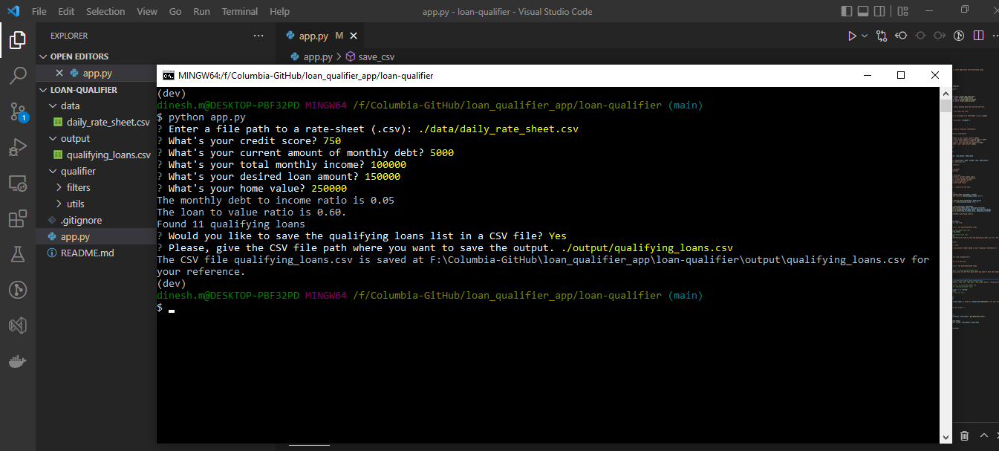

# Loan Application Qualifier

This is a python command-line interface application that allows BizOps team users to see qualifying loans from lenders quickly and easily. The application works by taking in a 'daily_rate_sheet' of loan criteria from various loan providers, asking the user a number of questions to evaluate their loan eligibility, and then returning to them a list of qualifying loans. Users can also save the lenders information in a separate CSV file for reference.

---

## Technologies

This project leverages python 3.7 with the following additional packages:
* [fire](https://github.com/google/python-fire) - For the command line interface, help page and the entry-point
* [questionary](https://github.com/tmbo/questionary) - For interactive user prompts and dialogs

---

## Installation Guide

Before running the application first install the following dependencies.

```sh
pip install fire
pip install questionary
```
---

## Usage

To use the loan qualifier application simply clone the repository and run the **app.py** with:

```python
python app.py
```

Upon launching the loan qualifier application, you will be greeted with the following prompts. Try out with similar user inputs to assess the experience.


---

## Contributors

FinTech Labs, Inc.

---

## License

None